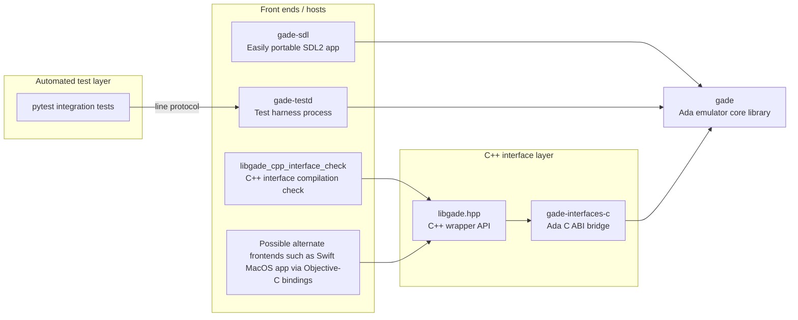

[](https://github.com/ellamosi/gade/actions/workflows/ci.yml)
[](https://coveralls.io/github/ellamosi/gade?branch=main)
[](https://ada-lang.io/)

# Gade
A Game Boy emulation library in Ada

This is a proof of concept for an interpreting emulator developed in Ada. It's meant to test the language's suitability for a project of this kind, the performance of generated code, and cross-language interaction. It's not meant to be the go-to emulator for simply playing Game Boy games.

## Background
This project started as an homage to [my university's Computer Architecture department](https://www.ac.upc.edu/en?set_language=en). I thoroughly enjoyed their courses, in which I went from not knowing binary to fully understanding how a modern CPU works, all the way down to the logic-gate level. This inspired me to write an emulator, and while looking for a balance between simplicity, size, and software-catalog popularity, I set my sights on the venerable Game Boy.

Why Ada? I learned to program in Ada, and I always felt that it was a more reliable candidate for native code compilation than the likes of C. The precise and platform-independent representation clauses the language offers, which allow precise definition of memory-mapped hardware, were also a factor in the decision. Also, while such emulators exist in plenty of other languages, I suspect this is the first one written in Ada.

## Library Architecture
`gade` is the emulator core library. It can be consumed by different front ends and by the test harness used by integration tests.

Today, the main consumers are:
- [`gade-sdl`](https://github.com/ellamosi/gade-sdl): sibling SDL front end project.
- [`gade-testd`](tests/harness/): command-driven harness binary used by `pytest` integration tests.

The architecture is intentionally set up so new front ends can be added without changing emulator core behavior (for example, a native macOS Swift front end via Objective-C bindings).



## Build
From `gade/`, using [Alire](https://alire.ada.dev/), you can build the library with:

```sh
alr build
```

For information on how to build and run the tests, see the [tests README](tests/README.md).

### Scenario Variables
`gade` exposes three GPR scenario variables through `alire.toml`:

- `GADE_BUILD_MODE`: `debug` enables safety/debug checks; `release` enables optimized runtime settings
- `GADE_LIBRARY_TYPE`: `relocatable` for shared builds, `static` for static linking, `static-pic` for static PIC artifacts
- `GADE_COVERAGE`: `false` | `true` (enables `--coverage` instrumentation)

## State of affairs

### What works
- Full CPU emulation (Passes Blargg's CPU instruction tests)
- Plain, MBC1, MBC2, MBC3 cartridge types with saves and MBC3 RTC support
- Joypad
- Timer
- Background Layer
- Window Layer
- Sprites
- Mid scanline rendering
- Audio

### What does not work
- Other cartridge controller types
- Accurate timings

### Next steps
- Performance optimizations (GPU rendering)
- Performance optimizations (CPU interpretation/Interrupt handling)
- Support for more cartridge types
