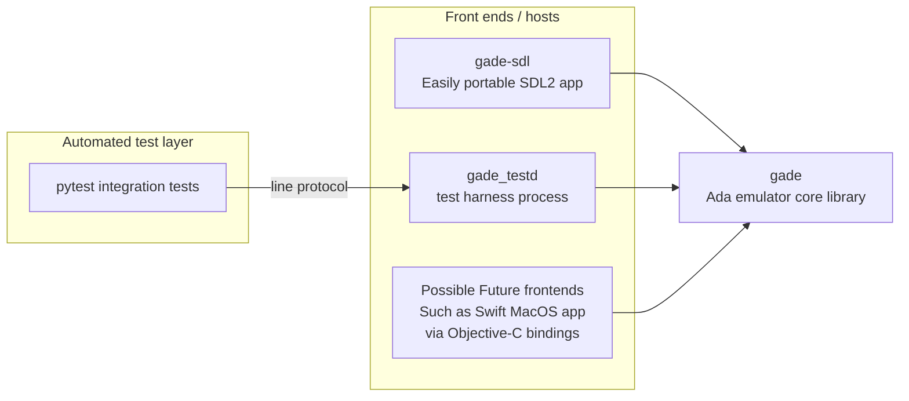

[](https://github.com/ellamosi/gade/actions/workflows/ci.yml)

# Gade
A GameBoy emulation library in Ada

This is a proof of concept for an interpreting emulator developed in Ada. It's meant to test the language's suitability for a project of this kind, the performance of generated code and cross language interaction. It's not meant to be the go-to emulator to just play GameBoy games.

## Background
This project started off as an homage to [my university's Computer Architecture department](https://www.ac.upc.edu/en?set_language=en). I throughly enjoyed their courses, in which I went from not knowing binary to fully understanding how a current CPU works, all the way down to logic gate level. This inspired me to write an emulator for a system, and looking for a balance between simplicity and size as well as popularity of its software catalog I set my eyes on the venerable GameBoy.

Why Ada? I learned to program in Ada, and I always felt that it was a more reliable candidate for native code compilation than the likes of C. The precise and platform independent representation clauses that the language offers that allow precisely defining the representation of memory mapped hardware was also a factor in the decision. Also, while such emulators exists in plenty of other languages I suspect it's the first one written in Ada.

## Library architecture
`gade` is the emulator core library. It can be consumed by different front ends and by the test harness used by integration tests.

Today, the main consumers are:
- [`gade-sdl`](https://github.com/ellamosi/gade-sdl): sibling SDL front end project.
- `tests/harness/gade_testd`: command-driven harness binary used by `pytest` integration tests.

The architecture is intentionally set up so new front ends can be added without changing emulator core behavior (for example, a native macOS Swift front end via Objective-C bindings).



## Build
From `gade/`:

```sh
alr build
```

### State of affairs

#### What works
- Full CPU emulation (Passes Blargg's CPU instruction tests)
- Plain, MBC1, MBC2, MBC3 cartridge types with saves and MBC3 RTC support
- Joypad
- Timer
- Background Layer
- Window Layer
- Sprites
- Mid scanline rendering
- Audio

#### What does not work
- Other cartridge controller types
- Accurate timings

#### Next steps
- Performance optimizations (GPU rendering)
- Performance optimizations (CPU interpretation/Interrupt handling)
- Support for more cartridge types
